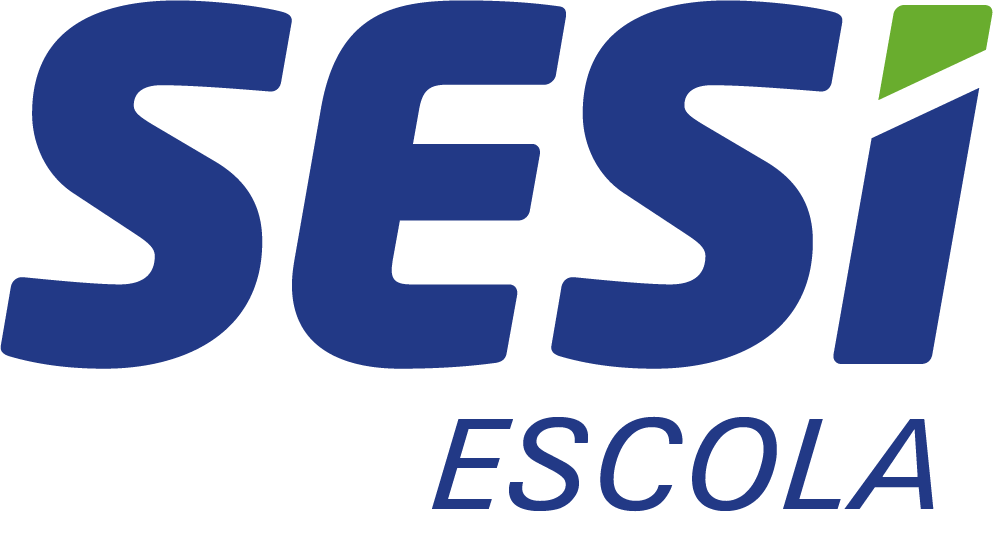

# SafeExam Online — Ambiente Seguro de Avaliação

> Sistema web moderno e utilitário nativo de segurança para aplicação e monitoramento de avaliações online em tempo real.



---

## 📌 Sobre o Projeto

O **SafeExam Online** foi desenvolvido para garantir a integridade pedagógica na realização de avaliações digitais (Google Forms, Microsoft Forms, Moodle, plataformas escolares). Ele combina um ambiente web blindado sincronizado em tempo real com um utilitário nativo em C# para Windows que bloqueia atalhos de sistema e tentativas de cola.

---

## 🚀 Principais Recursos

* **🌐 Monitoramento em Tempo Real (Firebase RTDB):**
  * Painel do Aplicador com visualização instantânea de todos os alunos conectados.
  * Detecção de perda de conexão (heartbeat e `onDisconnect`).
  * Desbloqueio presencial (senha local via hash SHA-256) ou remoto (1 clique no painel).
* **🔒 Utilitário Nativo de Bloqueio (`SafeExamBlocker.exe`):**
  * Hook de teclado de baixo nível (`WH_KEYBOARD_LL`).
  * Bloqueio de `Ctrl + Shift + Esc` (Gerenciador de Tarefas), `Win + Shift + S` (Captura), `Alt + Tab`, `Alt + F4`, `Alt + Space`, `Ctrl + Esc`, `F11`, `PrintScreen` e teclas `Win`.
  * Trava de instância única via `Mutex` (evita conflito de portas).
  * Comunicação local com o navegador via WebSocket seguro (`ws://127.0.0.1:8765`).
  * Atalho de emergência para o aplicador: **`Ctrl + Alt + Shift + F12`**.
* **🛡️ Blindagem no Navegador:**
  * Modo de tela cheia obrigatório com detecção de saída e troca de abas (`visibilitychange`).
  * Tratamento inteligente de foco que não gera falsos positivos ao digitar no `<iframe>`.
  * Prevenção de retorno no histórico via `popstate`.
* **👑 Painel Master Admin (`#admin`):**
  * Central com senha master para monitorar todas as salas ativas simultaneamente, alterar senhas e configurar obrigatoriedade do bloqueador.

---

## 📁 Estrutura de Arquivos

```text
├── index.html            # Estrutura e telas (Setup, Dashboard, Aluno, Prova, Admin)
├── style.css             # Design system SESI (Light/Dark themes, cards, animações)
├── app.js                # Lógica de negócio, Firebase RTDB, criptografia SHA-256 e segurança
├── Bloqueador.cs         # Código-fonte do bloqueador de teclado em C# .NET
├── SafeExamBlocker.exe   # Executável compilado para Windows
├── vercel.json           # Configuração de deploy, rotas limpas e cabeçalhos no Vercel
├── .gitignore            # Arquivos ignorados pelo controle de versão
├── logo.png              # Logo da instituição
└── README.md             # Documentação do projeto
```

---

## ⚡ Publicação no Vercel

O projeto está 100% pronto para publicação no [Vercel](https://vercel.com).

### Passo a Passo:
1. Acesse sua conta no [Vercel Dashboard](https://vercel.com/dashboard).
2. Clique em **Add New...** > **Project**.
3. Conecte sua conta do GitHub e selecione o repositório **`SafeExam-Online`**.
4. Em **Framework Preset**, deixe selecionado **Other** (HTML estático).
5. Clique em **Deploy**.

O arquivo [`vercel.json`](vercel.json) já está configurado para:
* Ativar URLs limpas (`cleanUrls`).
* Servir o arquivo [`SafeExamBlocker.exe`](SafeExamBlocker.exe) como anexo para download direto pelos alunos.
* Aplicar cabeçalhos de segurança HTTP.

---

## 💻 Compilação do Bloqueador C# (`Bloqueador.cs`)

### No macOS (com Mono):
```bash
mcs -target:exe -out:SafeExamBlocker.exe -r:System.Windows.Forms.dll -r:System.Drawing.dll Bloqueador.cs
```

### No Windows (com CSC / .NET Framework):
```cmd
C:\Windows\Microsoft.NET\Framework64\v4.0.30319\csc.exe /t:exe /out:SafeExamBlocker.exe Bloqueador.cs
```

---

## 🔒 Segurança e Privacidade

* Nenhuma senha do professor é transmitida em texto puro ou exposta nas URLs dos alunos.
* As validações de segurança utilizam criptografia padrão da Web Crypto API (`SHA-256`).
* O iframe da prova opera com atributos `sandbox` controlados e compatibilidade otimizada com Google Forms (`embedded=true`).

---

## 👤 Autor
Desenvolvido por **Mateus Zeca** — Todos os direitos reservados.
